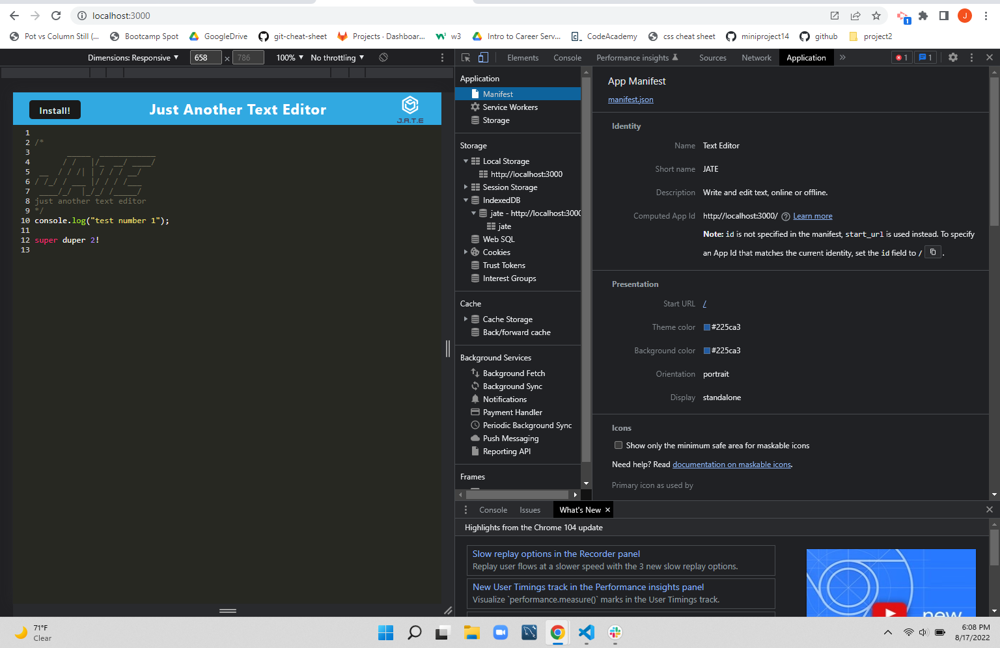
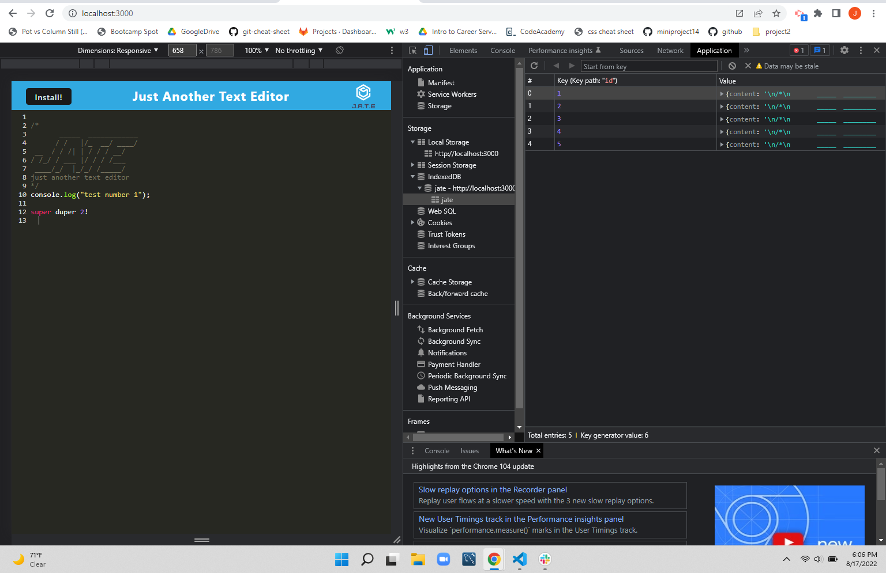

<h1 align="center">Text Editor: A Progressive Web Application</h1>

## Description

Progressive Web Application (PWA) that functions as a text editor for running in the browser. PWAs are different from native apps in that they allow for data persistence--both online AND online--and are quite useful where internet connectivity issues may hinder application functionality.

For this particular Text Editor app, we are using `idb`, which is a wrapper that helps with utilizing `IndexedDB` API interfaces. This is a popular method for getting and storing data, and is used widely, including in Google and Mozilla products.

## Installation Parameters

`npm i` allows for necessary installation of miscellaneous packages.

`npm run start:dev` can be used after to initialize the app. If the app is not able to be run because the designated port is being used, `npx kill-port 3000` can be used to clear and prepare for proper utility.

Once running, click on the `Install!` button on the top left of the JATE Text Editor and it will be integrated into your browser.

No other requirements for installation are needed.

## Application Mockup

When installed, text can be typed into the window. The data will persist even offline, due to the registered service worker. 
 

A `manifest.json` file is constructed, and is viewed here. 
 

Here we can view data stored correctly within IndexedDB.  
 

## Deployed Link (via Heroku)

fjfj

## Questions? Comments?

Contact me on Github or via email!  
Github: [github.com/joeytmab](github.com/joeytmab)  
Email: [joseph.t.binas@gmail.com](joseph.t.binas@gmail.com)
